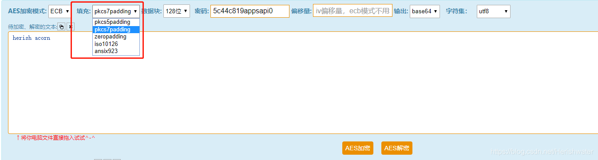

```
采用AES对称加密算法将信息加密并生成二维码，集加密解密于一体的demo程序
```
## [在线 AES 加密解密进行验证](http://tool.chacuo.net/cryptaes)



***

> ECB 是最简单的块密码加密模式，加密前根据加密块大小（如 AES 为128  位）分成若干块，之后将每块使用相同的密钥单独加密，解密同理。相对其他模式没有偏移量的设置，简单点，安全性差点。

 